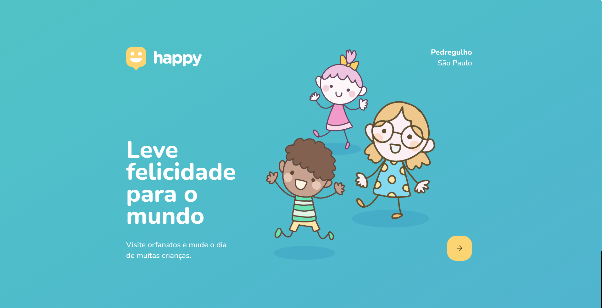
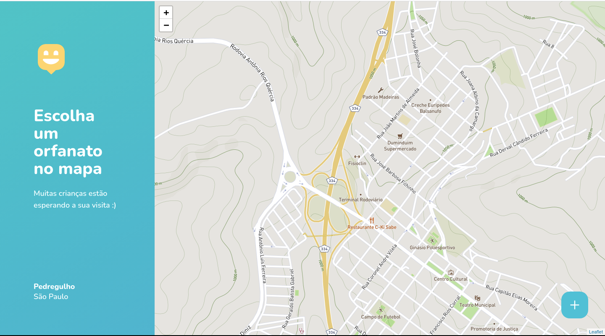

<h1 align="center">
    
</h1>

<p align="center">
  <a href="#computer-project">Project</a>&nbsp;&nbsp;&nbsp;|&nbsp;&nbsp;&nbsp;
  <a href="#rocket-technologies">Technologies</a>&nbsp;&nbsp;&nbsp;|&nbsp;&nbsp;&nbsp;
  <a href="#tada-features">Features</a>&nbsp;&nbsp;&nbsp;|&nbsp;&nbsp;&nbsp;
  <a href="#construction_worker-how-to-run">How to run</a>&nbsp;&nbsp;&nbsp;|&nbsp;&nbsp;&nbsp;
  <a href="#closed_book-license">License</a>
</p>
<p>
  
</p>
<p>
  
</p>

## :computer: Project
Happy is an application that connects people to institutional care homes to make many children happier.</br>
<strong>Project made in Next Level Week #3 @Rocketseat</strong>

## :rocket: Technologies

* [ReactJS](https://reactjs.org/)
  
* [React Native](https://reactnative.dev/)

* [Expo](https://expo.io/)

* [Node.js](https://nodejs.org/en/)
  
* [Express](https://expressjs.com/)

* [SQlite](https://www.sqlite.org/index.html)

* [TypeScript](https://www.typescriptlang.org/)


## :tada: Features

## :construction_worker: How to run


### Run API
```
# Go to server folder
$ cd nlw3-happy/backend

# Install Dependencies
$ yarn install

# Run Aplication
$ yarn dev

```

### Run Web Project
```
# Go to web folder
$ cd nlw3-happy/web

# Install Dependencies
$ yarn install

# Run Aplication
$ yarn start
```

### Run Mobile Project
> To run the mobile project you need a cellphone with the app of expo instaled or a emulator android/ios.
Then, fork this repository and clone to your machine. Inside of the project's folder run the following commands:
```
# Go to mobile folder
$ cd nlw3-happy/mobile

# Install Dependencies
$ yarn install

# Run Aplication
$ yarn start

```
> Then read the QRCode with the app's Expo or run on emulator.

## :closed_book: License
This project is under the MIT license. See the file [LICENSE](LICENSE.md) for more details.

---
<div align="center">
  <sub>The NLW #3 project. Built with :heart: by
    <a href="https://github.com/alauraivani">Anna Laura</a> and
    <a href="https://github.com/alauraivani/nlw3-happy/graphs/contributors">
      contributors
    </a>
  </sub>
</div>
